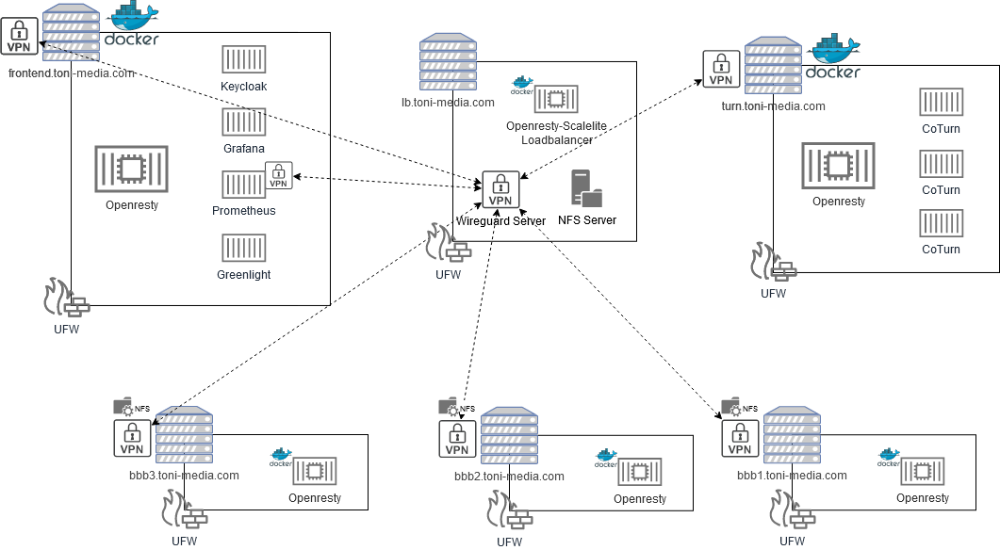

# toni.bbb 2.5 alpha
**Upgraded to BBB 2.5** - use at own risk.

Configuration is not "privacy by default" atm. You have to check all configuration files before using it in production.
Documentation has to be renewed, configuration-options have to be checked.

This project started in 2020. I wanted to setup an [BigBlueButton](https://bigbluebutton.org/) installation which respects all possible privacy aspects out of the box. It should still be simple to setup. At first I thought about deploying BigBlueButton to Kubernetes. After I found out that this is not an option at all, I played around with the existing ansible roles, referenced by the official BigBlueButton documentation. These roles have been my starting point. Because there have been some shortcommings and I never tried ansible before I decided to give it a try and create some ansible roles by myself. 

I wanted to be able to deploy a private (SSO) and scaleable installation of BigBlueButton behind a reverse-proxy (openresty).
The goal was to reuse as much componets as possible. So i decided to use openresty on the scalelite and BigBlueButton server as well.

So this is what i "finaly" came up with:

### SingleSignOn BigBluebutton Stack 



For my test setup I used 7 virtual machines @ Hetzner and an old domain i still owe: toni-media.com. 

###### Server: frontend.toni-media.com

- Openresty (docker)
- Keycloak (docker)
- Grafana (docker)
- Prometheus (docker)
- Greenlight (docker)

All user interactions are made with the openresty container as an authenticating reverse proxy. Openresty is configured to use keycloak to authenticate against and also manage the users. (Normally you would connect keycoak to LDAP or shiboleth, so that you dont have to manage users dicrectly in keycloak) To make this authenticating reverse proxy possible, it is necessary to install lua with nginx or to use [Openresty](https://openresty.org/en/) which has lua incorporated and is based on nginx. For this setup i am building an image of openresty during installation and copy the image to the nodes. Its possible to use openresty logging with different detail levels. (annonymized logs, debug logs, without logs....)
After installation all containers will be reachable through seperated and SSL secured subdomains. You can specify a wildcard certificate or automaticly deloy domain based certificates.

For server stats I use grafana. The dashboards for node-exporter and bbb-exporter are setup by default if monitoring is enabled. Prometheus will rely on the VPN connection to pull data from node-exporter and bbb-exporter on all nodes.
If greenlight gets installed the login (user and admin role - if set) will be bridged from the already authenticated user, so all user frontends only need to authenticate once (openresty).

###### Server: lb.toni-media.com

- modified scalelite (based on Openresty / docker)
- wireguard server
- NFS4 over wireguard

For this setup an modified [scalelite](https://github.com/blindsidenetworks/scalelite) loadbalancer is used. It behaves like the original one but uses openresty. Therefore an dockerimage is build during the setup. There is no CD/CI system or docker registry necessary because I am using a simple role to build docker images if needed. These images will be copied to the node.

Beside scalelite a wireguard (VPN) server gets installed on this machine. This server will also be used as NFS4 server, so that all BigBlueButton servers can store their files securely over VPN. Normally we would seperate scalelite from the NFS server. (If you are interested in an HA setup, you will want to install more than 1 scalelite loadbalancer).

###### Server: turn.<your-domain.com>

- Openresty (docker)
- 3 CoTurn (docker)

Coturn can be installed in 2 ways. Usually you will install it on a bare metall server or a virtual machine.
In my case I had some trouble with coturn. It stoped running from time to time. Because I didnt found the reason and there had been several questions floating around if its possible to setup coturn behind a proxy I decided to give it a try.
Off course there may be some limitations of my setup but openresty as stream proxy using port 443 in front of 3 coturn server worked for me (with bbb).

By now I have not been able to get the stream proxy working with keycloak authentication but its not necessary at all because of the coturn secret which will be used.

###### Server: bbb1.<your-domain.com> bbb2.<your-domain.com> and bbb3.<your-domain.com>

- BigBlueButton 
- Openresty (docker, replaces nginx)

BigBlueButton will be setup on 3 servers.
Privacy related configurations can be be applied, SIP can enabled,...

This setup has been working but the setup has to be with the roles I published on github. 

## Settings

In this setup several "one VM docker swarm maschines" are used as well as docker-composed machines. This setup is not for an real swarm cluster by now and will never be.
For this reason the role used to setup single machine clusters needs to run more that once. (With different hosts file)
It just happened... it works. If there is any further dev. i will migrate it complety to kubernetes.

Edit ansible hosts files and adjust values to your needs:
```bash
nano ./inventories/bbb/hosts
nano ./inventories/bbb_frontend/hosts # use same values except the 3 docker server groups at the end
```

Create a vault file with Password-string
```bash
nano ./vault
```

Edit role variables to fit your need:
```bash
nano ./inventories/bbb/group_vars/all.yml

# Change all vault-encrypted values with your own
ansible-vault encrypt_string --stdin-name 'VARIABLE NAME HERE' --vault-id bbb@vault
```

# Installation:
Clone the repository

'''
# Enter cloned repo and install requirements
ansible-galaxy install -r requirements.yml

# Some docker images used by this role have to be build (Openresty, Scalelite)
# This is NOT done by DevOps pipeline, images are build with ansible on a seperate machine and transfered by ansible
ansible-playbook ./builder.yml -i ./inventories/bbb --vault-id bbb@vault

# Install BBB (x*BBB, Coturn)
ansible-playbook ./bbb.yml -i ./inventories/bbb --vault-id bbb@vault

# Install frontend-server (Greenlight, Keycloak, Grafana, Prometheus)
ansible-playbook ./frontend.yml -i ./inventories/bbb_frontend --vault-id bbb@vault

... not finished ...
Next: publish role and describe configuration
